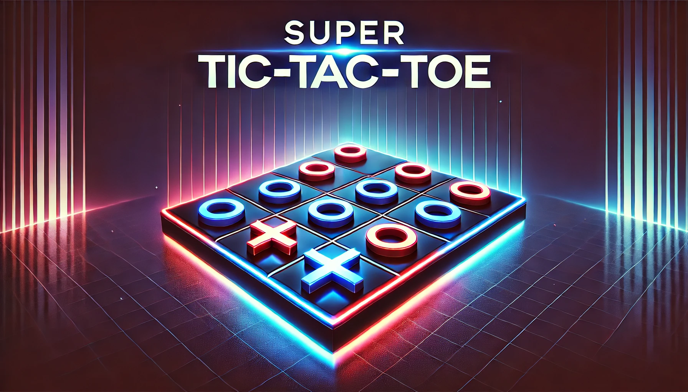
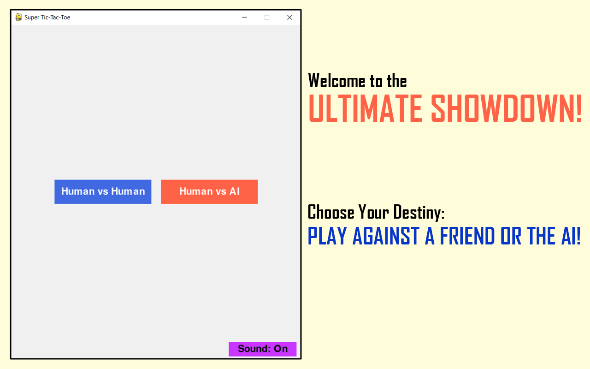
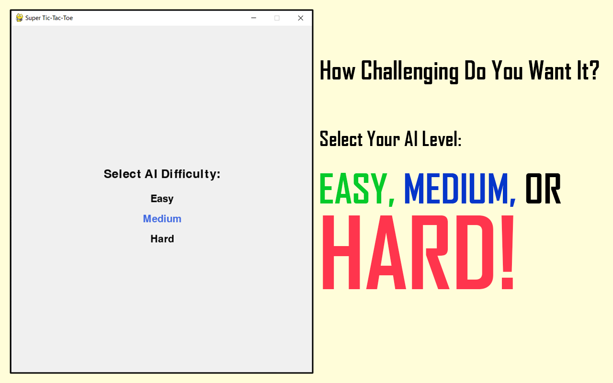
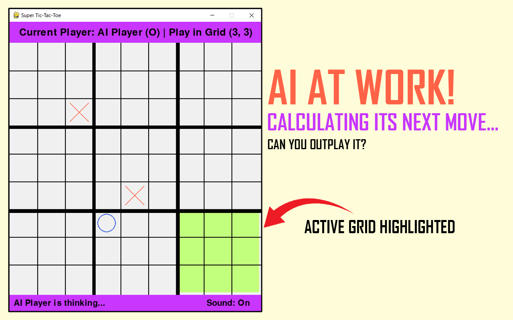
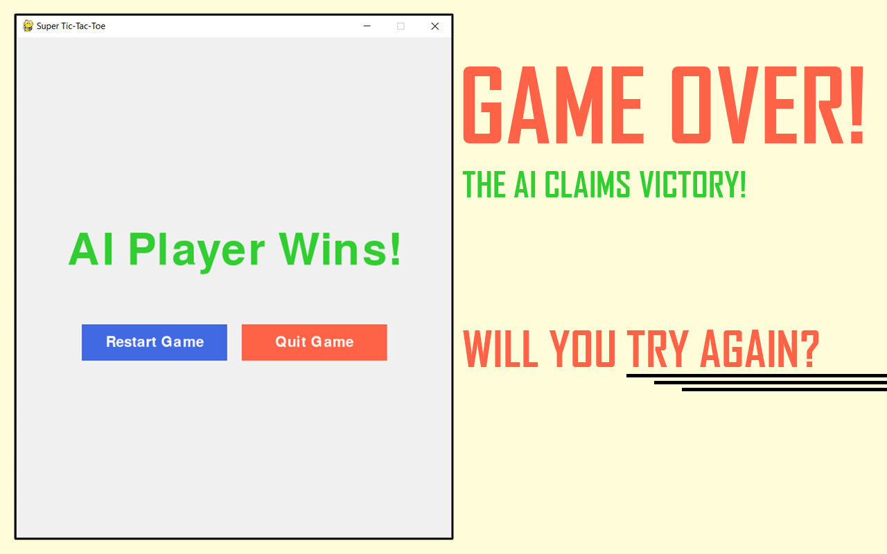

# Super Tic-Tac-Toe



**Super Tic-Tac-Toe** is an exciting enhancement of the classic Tic-Tac-Toe game, designed using Python and the Pygame library. This game allows players to engage in strategic matches against friends or challenge a sophisticated AI with adjustable difficulty levels, all while enjoying a smooth user interface and engaging sound effects.

## Features
- **Single and Multiplayer Modes**: Play against a friend or a challenging AI opponent.
- **AI Difficulty Settings**: Choose from **Easy**, **Medium**, or **Hard** levels to tailor the gameplay experience.
- **Interactive UI**: An intuitive interface that provides real-time feedback during matches.
- **Sound Toggle**: Control your audio experience with options to enable or disable background music.

## Gameplay
The game is played on a 3x3 grid of smaller grids, where players alternate turns placing their symbols (X or O). The objective is to win three smaller grids in a row—horizontally, vertically, or diagonally—on the larger 9x9 grid. Each match offers unique challenges, whether facing a human opponent or the AI.

## Screenshots

### 1. Main Menu

> **Main Menu**: Choose between **Human vs Human** or **Human vs AI** modes and adjust the sound settings to enhance your gameplay experience.

### 2. AI Difficulty Selection

> **AI Difficulty Settings**: Select your preferred challenge level with options for Easy, Medium, or Hard to suit your skills and provide a tailored gaming experience.

### 3. AI Thinking

> **AI Thinking**: The AI evaluates its available moves in real-time. The currently active grid is highlighted, clearly indicating where the next move can be made.

### 4. Game Over (AI Wins)

> **Game Over**: The AI player achieves victory at the Medium difficulty level, showcasing a seamless transition with options to restart or return to the main menu.

## How to Play
1. **Start the Game**: Select your desired game mode from the main menu.
2. **Select Difficulty** (if playing against AI): Choose the challenge level that suits your preference.
3. **Make Your Move**: Click on the highlighted grid to place your symbol (X or O).
4. **Win the Game**: To win, secure three smaller grids in a row—horizontally, vertically, or diagonally—on the larger grid. Use strategy to block your opponent while placing your symbols (X or O) effectively.
5. **Restart or Quit**: After the match, choose to restart or return to the main menu.

## Installation
To install and run this game locally, follow these steps:
1. Clone the repository:
   ```bash
   git clone https://github.com/Nafi7393/Super-TIC-TAC-TOE.git
   ```
2. Navigate to the project directory:
   ```bash
   cd Super-TIC-TAC-TOE
   ```
3. Install the required dependencies:
   ```bash
   pip install -r requirements.txt
   ```
4. Run the game:
   ```bash
   python main.py
   ```

## Technologies Used
- **Python**: The primary programming language used for game development.
- **Pygame**: A set of Python modules designed for writing video games.
- **Sound**: Custom audio for enhancing the gaming experience.

## Contributing
Contributions are welcome! If you would like to enhance the game or fix any bugs, please fork the repository, create a feature branch, and submit a pull request.
